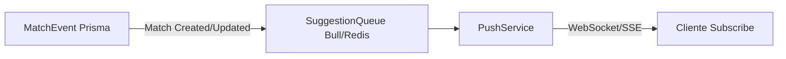

# ADR-0002: Sugestão de Partidas Compatíveis

**Status:** Proposed  
**Data:** 2026-07-20  
**Owner:** @arquitetura

---

## Contexto

Usuários do sistema rkt querem encontrar partidas disponíveis para participar ou assistir. Atualmente, o sistema permite criar e gerenciar partidas, mas não oferece mecanismos para **descobrir** partidas compatíveis com o perfil do usuário.

**Problema:** Como conectar jogadores disponíveis a partidas que correspondam ao seu nível técnico, localização, horário e preferências de formato?

**Forças em jogo:**
- **Relevância:** Sugestões devem ser personalizadas e úteis (não apenas listar todas as partidas)
- **Performance:** Consultas não podem degradar o sistema com crescimento de dados
- **Privacidade:** Partidas privadas não devem ser sugeridas indiscriminadamente
- **Tempo real:** Disponibilidade de partidas muda frequentemente
- **Simplicidade:** MVP deve ser viável sem algoritmos complexos de ML

---

## Decisão

Adotar modelo de domínio baseado em **MatchingCriteria** + **MatchSuggestion**, com estratégia de **polling sob demanda** para MVP.

### Modelo de Domínio

```typescript
// Critérios de matching (input do usuário ou sistema)
interface MatchingCriteria {
  playerIds: string[]           // Jogadores para considerar no matching
  maxTravelDistance?: number    // Km (opcional, baseado em club)
  preferredFormats?: MatchFormat[]
  timeWindow?: {
    start: Date
    end: Date
  }
  minRankingDifference?: number // Para matching por nível técnico
  visibility?: 'PUBLIC' | 'FRIENDS'
}

// Sugestão gerada pelo sistema
interface MatchSuggestion {
  id: string                    // CUID
  matchId: string               // Match existente ou null se for sugestão de criação
  reason: SuggestionReason      // Por que esta partida foi sugerida
  matchScore: number            // Score de compatibilidade (0-100)
  criteria: MatchingCriteria    // Critérios que geraram esta sugestão
  createdAt: Date
  expiresAt: Date               // Sugestões expiram (ex: 24h)
}

enum SuggestionReason {
  LEVEL_COMPATIBILITY = 'LEVEL_COMPATIBILITY',   // Ranking/nível similar
  LOCATION_PROXIMITY = 'LOCATION_PROXIMITY',     // Mesmo club ou região próxima
  SCHEDULE_AVAILABILITY = 'SCHEDULE_AVAILABILITY', // Horário compatível
  FORMAT_PREFERENCE = 'FORMAT_PREFERENCE',       // Formato preferido do usuário
  SOCIAL_CONNECTION = 'SOCIAL_CONNECTION',       // Jogadores com histórico conjunto
}
```

### Entidades do Schema Prisma (Proposta)

```prisma
model MatchSuggestion {
  id           String           @id @default(cuid())
  userId       String           // Usuário para quem a sugestão foi gerada
  matchId      String?          // Match existente (null se for sugestão de nova partida)
  reason       SuggestionReason
  matchScore   Int              // 0-100
  criteria     Json             // MatchingCriteria serializado
  isViewed     Boolean          @default(false)
  isDismissed  Boolean          @default(false)
  createdAt    DateTime         @default(now())
  expiresAt    DateTime
  user         User             @relation(fields: [userId], references: [id])
  match        Match?           @relation(fields: [matchId], references: [id])

  @@index([userId])
  @@index([expiresAt])
  @@index([userId, isViewed])
}

enum SuggestionReason {
  LEVEL_COMPATIBILITY
  LOCATION_PROXIMITY
  SCHEDULE_AVAILABILITY
  FORMAT_PREFERENCE
  SOCIAL_CONNECTION
}
```

**Nota:** Para MVP, podemos adiar a persistência e gerar sugestões **on-demand** (sem salvar no banco), mantendo apenas em memória/cache por sessão.

---

## Estratégia

### MVP: Polling Sob Demanda

Para a versão inicial, adotamos abordagem **request-response** simples:

```mermaid
flowchart LR
    A[Cliente] -->|GET /api/matches/suggestions| B[MatchSuggestion Service]
    B --> C[MatchRepository]
    C -->|Filters + Scoring| B
    B -->|[MatchSuggestion[]]| A
```

**Fluxo:**
1. Cliente chama `GET /api/matches/suggestions?criteria=...`
2. Service aplica filtros baseados nos critérios
3. Service calcula score de compatibilidade para cada match
4. Retorna top N sugestões ordenadas por score

### Futuro (Pós-MVP): Push Event-Driven



**Quando migrar:**
- Quando houver > 1000 partidas/mês no sistema
- Quando usuários reportarem "perder oportunidades" por não atualizar a lista
- Quando matching criteria se tornar mais complexo (ML, histórico)

---

## API Design

### Endpoints Propostos

#### 1. Listar Sugestões de Partidas

```http
GET /api/matches/suggestions
```

**Query Params:**
| Param | Tipo | Obrigatório | Descrição |
|-------|------|-------------|-----------|
| `playerId` | string | Sim | ID do jogador para matching |
| `maxDistance` | number | Não | Distância máxima em km (default: 50) |
| `timeWindow` | string | Não | JSON `{start, end}` ISO8601 |
| `formats` | string[] | Não | Formatos preferidos (comma-separated) |
| `limit` | number | Não | Máximo de sugestões (default: 10, max: 50) |

**Response 200:**
```json
{
  "suggestions": [
    {
      "matchId": "cjs5nqpr7000001l29u6qr9f1",
      "reason": "LEVEL_COMPATIBILITY",
      "matchScore": 85,
      "match": {
        "id": "cjs5nqpr7000001l29u6qr9f1",
        "format": "BEST_OF_3",
        "state": "SCHEDULED",
        "scheduledAt": "2026-07-25T14:00:00Z",
        "player1": { "id": "...", "name": "João", "ranking": 150 },
        "player2": { "id": "...", "name": "Maria", "ranking": 145 },
        "courtType": "QUICK",
        "visibility": "PUBLIC"
      },
      "matchingFactors": [
        { "factor": "RANKING_DIFF", "value": 5, "weight": 0.4 },
        { "factor": "SAME_CLUB", "value": true, "weight": 0.3 }
      ]
    }
  ],
  "meta": {
    "totalCandidates": 47,
    "filteredBy": ["VISIBILITY", "STATE"],
    "generatedAt": "2026-07-20T10:30:00Z"
  }
}
```

**Response 400:**
```json
{
  "error": "INVALID_CRITERIA",
  "message": "playerId é obrigatório",
  "details": { "field": "playerId" }
}
```

#### 2. Dismiss/Feedback (Opcional para MVP)

```http
POST /api/matches/suggestions/:id/dismiss
```

**Body:**
```json
{
  "reason": "NOT_INTERESTED",
  "feedback": "Formato não me interessa"
}
```

**Response 204:** No Content

### Contrato Zod (Proposta)

```typescript
// src/schemas/contracts.ts (adição)

export const SuggestionReasonSchema = z.enum([
  'LEVEL_COMPATIBILITY',
  'LOCATION_PROXIMITY',
  'SCHEDULE_AVAILABILITY',
  'FORMAT_PREFERENCE',
  'SOCIAL_CONNECTION',
]);
export type SuggestionReason = z.infer<typeof SuggestionReasonSchema>;

export const MatchingCriteriaSchema = z.object({
  playerId: z.string().min(1),
  maxDistance: z.number().positive().optional(),
  timeWindow: z.object({
    start: z.coerce.date(),
    end: z.coerce.date(),
  }).optional(),
  formats: z.array(MatchFormatSchema).optional(),
  limit: z.number().int().min(1).max(50).default(10),
});
export type MatchingCriteria = z.infer<typeof MatchingCriteriaSchema>;

export const MatchSuggestionSchema = z.object({
  matchId: z.string(),
  reason: SuggestionReasonSchema,
  matchScore: z.number().int().min(0).max(100),
  match: MatchSchema,
  matchingFactors: z.array(z.object({
    factor: z.string(),
    value: z.union([z.string(), z.number(), z.boolean()]),
    weight: z.number().min(0).max(1),
  })),
});
export type MatchSuggestion = z.infer<typeof MatchSuggestionSchema>;
```

---

## Consequências

### Positivas

- ✅ **Descoberta ativa:** Usuários encontram partidas sem buscar manualmente
- ✅ **Engajamento:** Aumenta probabilidade de participação em partidas
- ✅ **Extensível:** Modelo permite adicionar novos critérios facilmente
- ✅ **Mensurável:** Score de compatibilidade permite A/B testing de algoritmos
- ✅ **Baixo acoplamento:** Service isolado, não afeta core de matches

### Negativas

- ⚠️ **Complexidade de scoring:** Definir pesos dos fatores requer iteração
- ⚠️ **Performance:** Scoring em tempo real pode ser custoso com muitos matches
- ⚠️ **Cold start:** Usuários novos sem histórico têm sugestões menos relevantes
- ⚠️ **Manutenção:** Critérios de matching podem ficar desatualizados

### Neutras

- ➕ **Novo serviço:** `matchSuggestionService.ts` adicionado à codebase
- ➕ **Nova tabela (futuro):** `MatchSuggestion` no schema Prisma
- ➕ **Cache necessário:** Sugestões devem ser cacheadas (ex: 5 min) para performance

---

## Alternativas Consideradas

### A. Matching Baseado em ML (Reinforcement Learning)
**Prós:** Aprendizado contínuo, personalização fina, descobre padrões não óbvios  
**Contras:** Complexidade alta, requer dados históricos, overkill para MVP  
**Descartada porque:** Projeto ainda não tem volume de dados suficiente para treinar modelos

### B. Sistema de Convites Diretos (User-Initiated)
**Prós:** Controle total do usuário, sem "caixa preta", mais simples de implementar  
**Contras:** Requer effort ativo do usuário, descoberta passiva inexistente  
**Descartada porque:** Não resolve problema de descoberta para usuários passivos

### C. Feed de Partidas Públicas (Lista Simples)
**Prós:** Implementação trivial, transparente, sem algoritmos  
**Contras:** Sem personalização, overload de informação, baixa relevância  
**Descartada porque:** Não atende necessidade de **compatibilidade** (só lista, não sugere)

### D. Polling Sob Demanda + Scoring (Escolhida)
**Prós:** Balanceia simplicidade com personalização, fácil de iterar, mensurável  
**Contras:** Requer definição de pesos, não é "tempo real"  
**Selecionada porque:** MVP viável em 1-2 sprints, permite validação antes de investir em push/ML

---

## Fitness Functions (Mensuráveis)

| NFR | Meta | Como Medir |
|-----|------|------------|
| Relevância | ≥ 30% CTR (click-through) | Analytics: sugestões clicadas / visualizadas |
| Performance | < 500ms p95 latency | Monitoramento: `/api/matches/suggestions` |
| Cobertura | ≥ 80% dos usuários com ≥ 3 sugestões | Query: usuários com sugestões / total |
| Freshness | Sugestões atualizadas em ≤ 5 min | Cache TTL + timestamp no response |

---

## Handoff para @backend

### Tarefas de Implementação

1. **Schema (se persistir sugestões):**
   - Adicionar `MatchSuggestion` e `SuggestionReason` enum ao `schema.prisma`
   - Rodar `pnpm db:migrate` para criar tabela
   - Adicionar tipos ao `contracts.ts`

2. **Service Layer:**
   - Expandir `src/services/matchSuggestionService.ts` com:
     - `generateSuggestions(criteria: MatchingCriteria): Promise<MatchSuggestion[]>`
     - `calculateMatchScore(match: Match, criteria: MatchingCriteria): number`
     - `getMatchingFactors(match: Match, criteria: MatchingCriteria): MatchingFactor[]`
   - Implementar algoritmo de scoring (pesos iniciais sugeridos):
     - Ranking difference: 40% (menor diferença = maior score)
     - Same club: 30%
     - Format preference: 20%
     - Schedule availability: 10%

3. **API Route:**
   - Criar `src/app/api/matches/suggestions/route.ts`
   - GET handler com validação Zod
   - RLS context para filtrar por visibilidade
   - Response com sugestões + meta

4. **Testes:**
   - Unit: `matchSuggestionService.test.ts` (scoring logic)
   - Integration: `suggestions/route.test.ts` (API contract)
   - Characterization: Capturar comportamento atual se houver código legado

5. **Documentação:**
   - OpenAPI/Swagger (se existir no projeto)
   - README da API com exemplos de request/response

### Critérios de Aceite (DoD)

- [ ] Endpoint retorna sugestões válidas para critérios de teste
- [ ] Scoring é consistente (mesmos inputs = mesmos outputs)
- [ ] Partidas CANCELLED/PRIVATE não aparecem em sugestões
- [ ] Response inclui `meta` com informações de filtering
- [ ] Testes unitários cobrem ≥ 80% da lógica de scoring
- [ ] Testes de integração validam contrato da API
- [ ] Mutation score ≥ 60% (Stryker)
- [ ] 0 erros TypeScript + 0 erros ESLint

### Referências Técnicas

- `src/services/matchService.ts` — Padrão de service layer
- `src/services/matchRepository.ts` — Padrão de repository
- `src/app/api/matches/route.ts` — Exemplo de route handler
- `src/schemas/contracts.ts` — Definição de tipos Zod
- `src/lib/rls-context.ts` — Contexto para RLS

---

## Referências

- `prisma/schema.prisma` — Schema atual do banco
- `src/services/matchSuggestionService.ts` — Serviço existente (parcial)
- `docs/adr/ADR-0001-adocao-multiagente.md` — Formato padrão de ADRs
