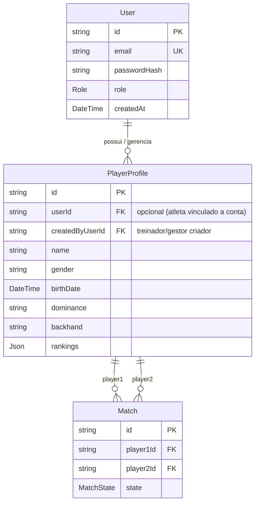

# ADR-0007: Separação Conceitual entre Conta de Acesso (User) e Perfil de Atleta (Player)

**Status:** Accepted  
**Data:** 2026-09-11  
**Owner:** @arquitetura  
**Supersedes:** —  
**Depends on:** ADR-0001, ADR-0005  

---

## Contexto

No modelo de dados inicial da plataforma RKT, a tabela `Player` acumulou duas responsabilidades distintas:
1. **Credencial de Acesso e Autenticação (`User`):** campos como `email`, `passwordHash`, `role` (ADMIN, GESTOR, COACH, ATHLETE, SPECTATOR), sessões JWT e RLS context.
2. **Entidade Desportiva de Quadra (`Player`):** campos como `dominance`, `backhand`, `birthDate`, `age`, `ranking`, `rankings`, além dos relacionamentos com `Match` (`matchesAsPlayer1`, `matchesAsPlayer2`).

### Problemas e Conflitos Identificados na Auditoria
1. **Atletas Não-Usuários e Menores de Idade:** Um técnico ou clube cadastra atletas mirins ou parceiros de treino que não possuem e-mail próprio nem login no app. O modelo forçava `email` único e `passwordHash` para qualquer jogador em quadra.
2. **Múltiplos Perfis por Usuário:** Um treinador (`COACH`) ou gestor (`GESTOR`) pode também ser tenista e disputar partidas em torneios internos, ou gerenciar o perfil desportivo de dependentes.
3. **Ambiguidade de Ownership e IDOR:** Ao editar `/api/players/[id]`, o sistema precisava verificar se o `user.id` correspondia ao `id` do atleta ou ao `createdByUserId`, gerando duplicidade semântica entre usuário do sistema e atleta.

---

## Decisão

Formalizar o plano de transição arquitetural para desacoplar `User` (autenticação, controle de acesso, tenancy) de `PlayerProfile` (dados desportivos, histórico de jogos e estatísticas de quadra).

### 1. Modelo Alvo Proposto

### 2. Regras de Transição e Fronteira (Fases de Migração)

- **Fase Atual (Compatibilidade Legada Segura):**
  - Mantém o schema Prisma unificado sem quebra de banco de dados (`model Player` com `createdByUserId`).
  - Blindagem de autorização em rotas de API:
    - O atleta autenticado só pode modificar/excluir seu próprio registro (`user.id === player.id`).
    - Treinadores e gestores podem gerenciar atletas criados por eles (`user.id === player.createdByUserId`).
    - Staff com roles `ADMIN` e `GESTOR` possuem permissão ampla de moderação.
- **Fase Futura (Extração de Entidades):**
  - Criação da tabela `User` para conter apenas auth (`id`, `email`, `passwordHash`, `role`).
  - Adaptação de `Player` para `PlayerProfile`, vinculando `userId` como chave estrangeira nullable.
  - Migração de dados sem downtime preservando integridade referencial com `Match`.

---

## Consequências

### Positivas
- Elimina a exigência de e-mail e credenciais para atletas cadastrados em massa por clubes e escolas.
- Permite que um mesmo usuário administre múltiplos atletas (ex: pais administrando filhos tenistas).
- Alinha perfeitamente as políticas de RLS no PostgreSQL com o domínio de autenticação (`User`) e dados de quadra (`PlayerProfile`).

### Neutras / Acompanhamento
- A migração física das tabelas será agendada na fila de refatoração (`docs/REFACTOR_QUEUE.md`) sem interrupção de serviço, aplicando a regra de corte de `AGENTS.md`.
